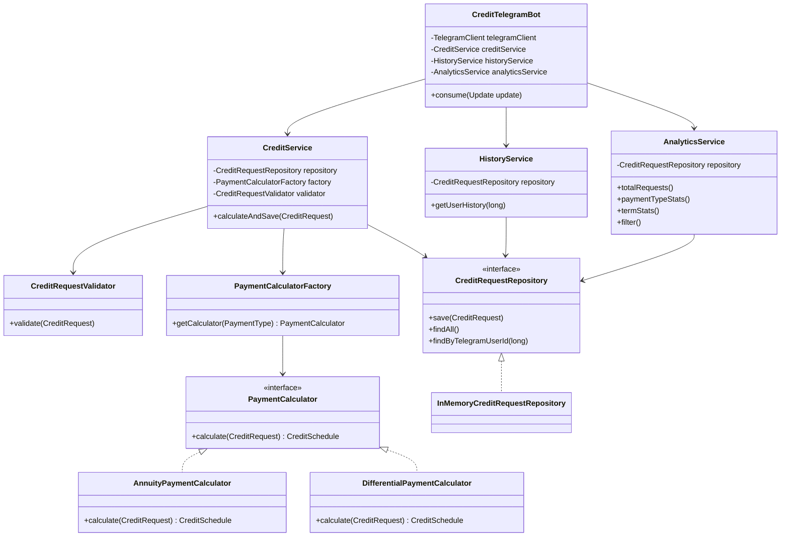

# Credit Telegram Bot


Telegram-бот для расчёта графиков погашения кредитов с поддержкой аннуитетных и дифференцированных платежей.

Проект разработан в учебных целях и демонстрирует применение принципов:

- Abstraction;
- Composition;
- Low Coupling;
- High Cohesion;
- SOLID;
- DRY;
- KISS;
- YAGNI.

---

## Содержание

- [Описание проекта](#описание-проекта)
- [Цель и задачи](#цель-и-задачи)
- [Возможности](#возможности)
- [Технологии](#технологии)
- [Архитектура](#архитектура)
- [Структура проекта](#структура-проекта)
- [Принципы проектирования](#принципы-проектирования)
- [Алгоритмы расчёта](#алгоритмы-расчёта)
- [Быстрый запуск](#быстрый-запуск)
- [Настройка конфигурации](#настройка-конфигурации)
- [Использование бота](#использование-бота)
- [Хранение данных](#хранение-данных)
- [Роли пользователей](#роли-пользователей)
- [Тестирование](#тестирование)
- [Безопасность](#безопасность)
- [Возможные улучшения](#возможные-улучшения)
- [Лицензия](#лицензия)

---

## Описание проекта

Пользователям часто сложно самостоятельно рассчитать график погашения кредита с учётом суммы, срока, процентной ставки и
типа платежа.

Менеджеры компании также не имеют удобного инструмента для анализа интересов клиентов и популярных параметров кредитов.

Данный проект решает обе задачи с помощью Telegram-бота, который:

- принимает параметры кредита;
- рассчитывает график платежей;
- сохраняет запрос пользователя;
- предоставляет историю расчётов;
- формирует статистику для менеджеров.

---

## Цель и задачи

### Цель проекта

Разработать Telegram-бота для автоматизированного расчёта кредитных графиков и анализа пользовательских запросов.

### Задачи проекта

- Реализовать Telegram-бота на Java.
- Добавить пошаговый диалог с пользователем.
- Реализовать аннуитетную схему расчёта.
- Реализовать дифференцированную схему расчёта.
- Сохранять параметры кредитных запросов.
- Реализовать просмотр истории пользователя.
- Добавить менеджерскую аналитику.
- Реализовать фильтрацию запросов.
- Обеспечить проверку входных данных.
- Продемонстрировать применение принципов ООП и SOLID.
- Подготовить документацию и тесты.

---

## Возможности

### Для пользователей

| Возможность               | Описание                                             |
|---------------------------|------------------------------------------------------|
| Расчёт кредита            | Ввод суммы, срока, ставки и типа платежа             |
| Аннуитетный график        | Расчёт равных ежемесячных платежей                   |
| Дифференцированный график | Расчёт платежей, уменьшающихся со временем           |
| Детальный график          | Тело кредита, проценты, общий платёж и остаток долга |
| История запросов          | Просмотр предыдущих расчётов пользователя            |
| Валидация данных          | Проверка суммы, срока, ставки и типа платежа         |

### Для менеджеров

| Возможность          | Описание                                               |
|----------------------|--------------------------------------------------------|
| Общая статистика     | Количество всех кредитных запросов                     |
| Статистика по типам  | Популярность аннуитетных и дифференцированных платежей |
| Статистика по срокам | Анализ популярных сроков кредитования                  |
| Статистика по суммам | Анализ наиболее часто запрашиваемых сумм               |
| Фильтрация           | Поиск запросов по сумме и типу платежа                 |
| Ограниченный доступ  | Доступ к аналитике только для менеджеров               |

---

## Технологии

- Java 21;
- Spring Boot 3.5;
- Telegram Bots API;
- TelegramBots Spring Boot Starter;
- Maven;
- Java Collections Framework;
- BigDecimal для денежных расчётов;
- JUnit 5 для тестирования;
- PostgreSQL — планируемое или подключаемое постоянное хранилище;
- Flyway — управление миграциями базы данных.

TelegramBots Spring Boot Starter автоматически регистрирует Spring-компонент бота при запуске приложения и поддерживает
режим long polling. [119]

---

## Архитектура

Проект построен по слоистой архитектуре.

```text
┌──────────────────────────────┐
│      Telegram Bot Layer      │
│  CreditTelegramBot           │          │
└──────────────┬───────────────┘
               │
               ▼
┌──────────────────────────────┐
│       Service Layer          │
│  CreditService               │
│  HistoryService              │
│  AnalyticsService            │
└──────────────┬───────────────┘
               │
       ┌───────┴────────┐
       ▼                ▼
┌──────────────┐ ┌───────────────┐
│ Calculator   │ │ Validation    │
│ Layer        │ │ Layer         │
└──────┬───────┘ └───────────────┘
       │
       ▼
┌──────────────────────────────┐
│      Repository Layer         │
│  CreditRequestRepository      │
│  InMemory / PostgreSQL        │
└──────────────────────────────┘
```

### Основные слои

| Пакет         | Ответственность                           |
|---------------|-------------------------------------------|
| `bot`         | Telegram-команды и диалог с пользователем |
| `calculator`  | Расчёт графиков платежей                  |
| `domain`      | Модели предметной области                 |
| `repository`  | Абстракция хранения данных                |
| `service`     | Бизнес-логика, история и аналитика        |
| `validation`  | Проверка входных параметров               |
| `persistence` | Работа с JPA-сущностями и PostgreSQL      |

---

## Структура проекта

```text
src
├── main
│   ├── java
│   │   └── com
│   │       └── example
│   │           └── creditbot
│   │               │   CreditBotApplication.java
│   │               │
│   │               +---bot
│   │               │       ConversationService.java
│   │               │       ConversationStep.java
│   │               │       CreditTelegramBot.java
│   │               │       UserSession.java
│   │               │
│   │               +---calculator
│   │               │       AnnuityPaymentCalculator.java
│   │               │       DifferentialPaymentCalculator.java
│   │               │       PaymentCalculator.java
│   │               │       PaymentCalculatorFactory.java
│   │               │
│   │               +---domain
│   │               │       CreditRequest.java
│   │               │       CreditSchedule.java
│   │               │       Payment.java
│   │               │       PaymentType.java
│   │               │
│   │               +---persistence
│   │               │   │   PostgresCreditRequestRepository.java
│   │               │   │
│   │               │   +---entity
│   │               │   │       CreditRequestEntity.java
│   │               │   │
│   │               │   \---repository
│   │               │           CreditRequestJpaRepository.java
│   │               │
│   │               +---repository
│   │               │       CreditRequestRepository.java
│   │               │       InMemoryCreditRequestRepository.java
│   │               │
│   │               +---security
│   │               │       ManagerAuthService.java
│   │               │       ManagerSession.java
│   │               │
│   │               +---service
│   │               │       AnalyticsService.java
│   │               │       CreditService.java
│   │               │       HistoryService.java
│   │               │
│   │               \---validation
│   │                       CreditRequestValidator.java
│   │
│   \---resources
│       │   application-dev.yml
│       │   application.yml
│       │
│       \---db
│           \---migration
│                   V1__create_credit_requests.sql
│
\---test
    \---java
        \---com
            \---example
                \---creditbot
                    +---calculator
                    │       AnnuityPaymentCalculatorTest.java
                    │       DifferentialPaymentCalculatorTest.java
                    │
                    \---validation
                            CreditRequestValidatorTest.java
```

---

## Принципы проектирования

### Abstraction

Расчёт графика описывается интерфейсом:

```java
public interface PaymentCalculator {

    CreditSchedule calculate(CreditRequest request);
}
```

`CreditService` работает с интерфейсом и не зависит от конкретной формулы.

### Composition

`CreditService` состоит из независимых компонентов:

```java
private final CreditRequestRepository repository;
private final PaymentCalculatorFactory calculatorFactory;
private final CreditRequestValidator validator;
```

Объекты передаются через конструктор, что упрощает тестирование и замену реализаций.

### Low Coupling

`CreditTelegramBot` не знает, как рассчитываются проценты и как хранятся данные.

Он взаимодействует с бизнес-логикой через сервисы:

```text
CreditTelegramBot → CreditService
CreditTelegramBot → HistoryService
CreditTelegramBot → AnalyticsService
```

### High Cohesion

Каждый класс имеет одну основную ответственность:

- `CreditTelegramBot` — обработка сообщений;
- `CreditService` — расчёт и сохранение;
- `CreditRequestValidator` — проверка данных;
- `AnalyticsService` — аналитика;
- `HistoryService` — история;
- `PaymentCalculator` — формула расчёта.

### SOLID

- **Single Responsibility** — каждый класс отвечает за одну задачу.
- **Open/Closed** — новый тип платежа можно добавить новым калькулятором.
- **Liskov Substitution** — калькуляторы взаимозаменяемы через интерфейс.
- **Interface Segregation** — интерфейсы содержат только необходимые методы.
- **Dependency Inversion** — сервисы зависят от абстракций, а не от конкретных реализаций.

### DRY

Общие проверки вынесены в `CreditRequestValidator`.  
Бизнес-логика не копируется в обработчиках команд.

### KISS

Проект использует простую слоистую архитектуру без преждевременного усложнения.

### YAGNI

Функции, которые не нужны текущей версии проекта, не добавляются без необходимости.

---

## Алгоритмы расчёта

### Аннуитетная схема

При аннуитетной схеме размер регулярного платежа остаётся практически одинаковым на протяжении всего срока кредита.

Формула:

```text
A = S × (i × (1 + i)^n) / ((1 + i)^n − 1)
```

где:

- `A` — ежемесячный платёж;
- `S` — сумма кредита;
- `i` — месячная процентная ставка;
- `n` — срок кредита в месяцах.

Внутри приложения месячная ставка вычисляется так:

```text
i = годовая ставка / 12 / 100
```

### Дифференцированная схема

При дифференцированной схеме основная часть долга делится равномерно:

```text
Основной платёж = Сумма кредита / Количество месяцев
```

Проценты рассчитываются от остатка задолженности:

```text
Проценты = Остаток долга × Месячная ставка
```

Поэтому в начале срока платёж больше, а затем постепенно уменьшается.

### Денежные расчёты

Для денежных значений используется `BigDecimal`, а не `double`, чтобы избежать ошибок округления.

Все денежные значения округляются до двух знаков после запятой.

---

## Быстрый запуск

### Требования

Перед запуском установите:

- JDK 21 или выше;
- Maven 3.9 или выше;
- Telegram;
- PostgreSQL — если используется постоянное хранилище.

Проверка Java:

```bash
java -version
```

Проверка Maven:

```bash
mvn -version
```

### 1. Создание Telegram-бота

1. Откройте Telegram.
2. Найдите `@BotFather`.
3. Выполните команду `/newbot`.
4. Укажите имя бота.
5. Укажите username, который должен заканчиваться на `bot`.
6. Скопируйте токен.

Токен нельзя публиковать в GitHub или README.

### 2. Клонирование проекта

```bash
git clone [https://github.com/YOUR_USERNAME/credit-telegram-bot.git](https://github.com/YOUR_USERNAME/credit-telegram-bot.git)
cd credit-telegram-bot
```

### 3. Установка зависимостей

```bash
mvn clean install
```

### 4. Запуск через Maven

```bash
mvn spring-boot:run
```

### 5. Сборка JAR-файла

```bash
mvn clean package
```

### 6. Запуск JAR-файла

```bash
java -jar target/credit-telegram-bot-1.0.0.jar
```

### 7. Запуск из IntelliJ IDEA

1. Откройте класс `CreditBotApplication`.
2. Нажмите зелёную кнопку `Run`.
3. Дождитесь сообщения:

```text
Started CreditBotApplication
```

4. Откройте бота в Telegram.
5. Отправьте команду `/start`.

---

## Настройка конфигурации

### Вариант для разработки

Файл:

```text
src/main/resources/application.yml
```

```yaml
telegram:
  bot:
    username: credit_olga_telegram_bot
    token: "YOUR_TELEGRAM_BOT_TOKEN"

  manager-password: "YOUR_MANAGER_PASSWORD"
  manager-ids:
    - 123456789
```

`123456789` необходимо заменить на числовой Telegram ID менеджера.

### Рекомендуемый вариант

Spring Boot поддерживает внешнюю конфигурацию через переменные окружения, поэтому секреты можно не хранить внутри
исходного кода и конфигурационных файлов. [232][233]

```yaml
telegram:
  bot:
    username: credit_olga_telegram_bot
    token: ${TELEGRAM_BOT_TOKEN}

  manager-password: ${TELEGRAM_MANAGER_PASSWORD}
  manager-ids: ${TELEGRAM_MANAGER_IDS:}
```

#### Windows PowerShell

```powershell
$env:TELEGRAM_BOT_TOKEN="YOUR_TELEGRAM_BOT_TOKEN"
$env:TELEGRAM_MANAGER_PASSWORD="YOUR_MANAGER_PASSWORD"
$env:TELEGRAM_MANAGER_IDS="123456789"

mvn spring-boot:run
```

#### Linux/macOS

```bash
export TELEGRAM_BOT_TOKEN="YOUR_TELEGRAM_BOT_TOKEN"
export TELEGRAM_MANAGER_PASSWORD="YOUR_MANAGER_PASSWORD"
export TELEGRAM_MANAGER_IDS="123456789"

mvn spring-boot:run
```

---

## Подключение PostgreSQL

Если используется PostgreSQL, добавьте в `application.yml`:

```yaml
spring:
  datasource:
    url: ${DB_URL:jdbc:postgresql://localhost:5432/credit_bot}
    username: ${DB_USERNAME:postgres}
    password: ${DB_PASSWORD:postgres}
    driver-class-name: org.postgresql.Driver

  jpa:
    hibernate:
      ddl-auto: validate
    open-in-view: false
    properties:
      hibernate:
        format_sql: true

  flyway:
    enabled: true
    locations: classpath:db/migration
```

Переменные окружения:

```bash
export DB_URL="jdbc:postgresql://localhost:5432/credit_bot"
export DB_USERNAME="postgres"
export DB_PASSWORD="postgres"
```

Для учебного варианта можно использовать `InMemoryCreditRequestRepository`. Однако данные такого хранилища исчезают
после остановки приложения.

Для дипломной версии рекомендуется PostgreSQL, так как он обеспечивает постоянное хранение истории запросов и аналитики.

---

## Использование бота

### Команды пользователя

| Команда      | Назначение                            |
|--------------|---------------------------------------|
| `/start`     | Приветствие и список доступных команд |
| `/calculate` | Запуск расчёта кредита                |
| `/history`   | История запросов пользователя         |
| `/help`      | Инструкция по использованию           |

### Команды менеджера

| Команда          | Назначение                   |
|------------------|------------------------------|
| `/analytics`     | Общая статистика по запросам |
| `/filter`        | Фильтрация запросов          |
| `/manager_login` | Авторизация менеджера        |

Доступ к менеджерским командам должен проверяться по Telegram ID или через отдельный механизм авторизации.

### Пример диалога

```text
Пользователь: /calculate

Бот: Введите сумму кредита:

Пользователь: 1000000

Бот: Введите срок кредита в месяцах:

Пользователь: 60

Бот: Введите годовую процентную ставку:

Пользователь: 12

Бот: Выберите тип платежа:
1 — аннуитетный
2 — дифференцированный

Пользователь: 1

Бот:
График платежей
Переплата: 33673.12
Общая сумма выплат: 1033673.12

Месяц 1: ...
Месяц 2: ...
```

---

## Хранение данных

### In-memory-режим

В учебной версии для хранения могут использоваться:

- `ArrayList`;
- `HashMap`;
- `ConcurrentHashMap`.

Преимущества:

- простая реализация;
- не требуется отдельная база;
- удобно для демонстрации архитектуры.

Недостаток:

- данные теряются после перезапуска приложения.

### PostgreSQL-режим

Для дипломной или production-версии рекомендуется PostgreSQL.

Преимущества:

- постоянное хранение данных;
- поддержка фильтрации и сортировки;
- индексы;
- возможность масштабирования;
- сохранение истории после перезапуска приложения.

Абстракция репозитория позволяет заменить in-memory-реализацию на PostgreSQL без
изменения `CreditService`, `HistoryService` и `AnalyticsService`.

---

## Тестирование

Для запуска тестов:

```bash
mvn test
```

### Проверяемые сценарии

- Расчёт аннуитетного графика.
- Расчёт дифференцированного графика.
- Нулевая процентная ставка.
- Корректное округление денежных значений.
- Остаток долга равен нулю после последнего платежа.
- Отрицательная или нулевая сумма.
- Некорректный срок.
- Некорректная процентная ставка.
- Неизвестный тип платежа.
- Сохранение кредитного запроса.
- Получение истории пользователя.
- Формирование аналитики.
- Ограничение доступа к командам менеджера.

### Пример тестовых данных

```text
Сумма: 100000
Срок: 12 месяцев
Ставка: 12%
Тип: аннуитетный
```

Ожидаемый результат:

- 12 платежей;
- сумма основного долга равна 100000;
- остаток долга после последнего платежа равен 0;
- общая сумма выплат больше суммы кредита при ненулевой ставке.

---

## Обработка ошибок

Бот должен корректно обрабатывать:

- пустые сообщения;
- текст вместо числа;
- отрицательную сумму;
- нулевой срок;
- срок больше 360 месяцев;
- отрицательную ставку;
- ставку больше 100%;
- неправильный выбор типа платежа;
- отсутствие данных для истории;
- отсутствие прав менеджера.

Пример ответа:

```text
Ошибка: Введите корректную сумму кредита
```

После ошибки пользователь может повторить ввод, не начиная диалог заново.

---

## Безопасность

- Не храните Telegram-токен в Git.
- Не храните пароль менеджера в открытом репозитории.
- Используйте переменные окружения.
- Добавьте секретные файлы в `.gitignore`.
- При утечке токена перевыпустите его через `@BotFather`.
- Не выводите токены и пароли в логи.
- Ограничьте менеджерские команды по Telegram ID.
- Не передавайте персональные данные пользователей в открытые логи.

Пример `.gitignore`:

```gitignore
target/
.idea/
*.iml

.env
application-local.yml

*.log
```

Проверка перед публикацией:

```bash
git status
git diff --cached
```

---

## Диаграмма классов



---

## Почему архитектура соответствует требованиям

| Требование      | Реализация                                                 |
|-----------------|------------------------------------------------------------|
| Абстракция      | Интерфейсы `PaymentCalculator` и `CreditRequestRepository` |
| Композиция      | Сервисы получают зависимости через конструктор             |
| Factory pattern | `PaymentCalculatorFactory`                                 |
| Low Coupling    | Сервисы зависят от интерфейсов                             |
| High Cohesion   | Каждый класс отвечает за одну область                      |
| SOLID           | Разделение ответственности и Dependency Injection          |
| DRY             | Общая валидация в `CreditRequestValidator`                 |
| KISS            | Простая слоистая архитектура                               |
| YAGNI           | Нет лишних компонентов до появления требований             |
| ООП             | Инкапсуляция, полиморфизм, интерфейсы и композиция         |

---

## Возможные улучшения

- Перевод хранилища на PostgreSQL.
- Использование Flyway для миграций.
- Экспорт графика в CSV или PDF.
- Inline-кнопки Telegram вместо ручного ввода.
- Досрочное погашение кредита.
- Пересчёт графика после досрочного платежа.
- Отдельная веб-панель менеджера.
- Пагинация истории запросов.
- Docker Compose для запуска приложения и PostgreSQL.
- Testcontainers для интеграционных тестов.
- Spring Security для отдельной панели менеджера.
- Мониторинг с помощью Actuator.
- Логирование через SLF4J.
- CI/CD через GitHub Actions.

---

## Результаты проекта

В результате разработан Telegram-бот, который:

- принимает параметры кредита;
- рассчитывает два типа графиков;
- выводит детализацию по каждому месяцу;
- проверяет корректность пользовательского ввода;
- сохраняет запросы;
- предоставляет историю пользователя;
- формирует статистику для менеджеров;
- демонстрирует применение принципов ООП, SOLID и слоистой архитектуры.

---

## Лицензия

Проект создан в учебных целях.

Использование кода допускается для обучения и демонстрации принципов разработки программного обеспечения.

---

## Автор

**Ольга Дегтярева**

GitHub: `https://github.com/degtuareva`

Telegram-бот: `@credit_olga_telegram_bot`